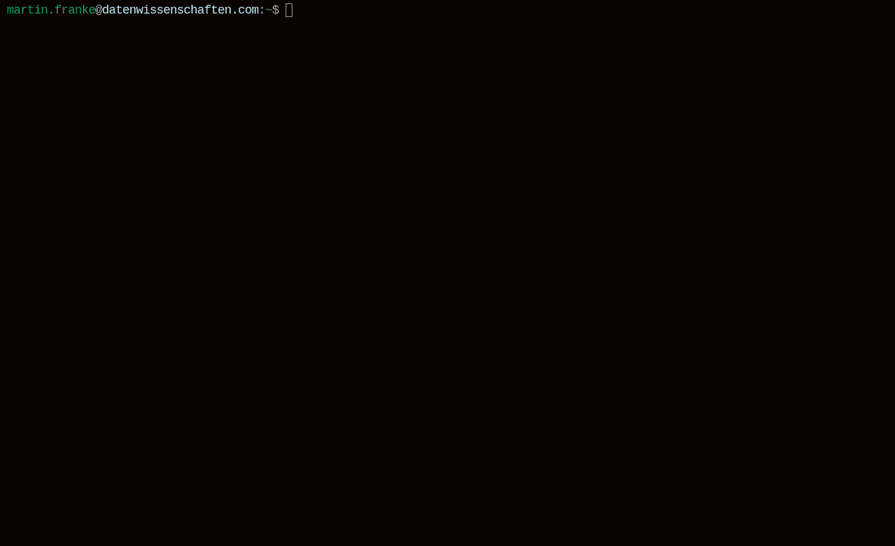

# Retro Speedlab Cookiecutter

Generate a complete retro reinforcement-learning project built around Stable
Retro and the `datenwissenschaften` training toolkit.



The generated project includes:

- a runnable `Airstriker-Genesis-v0` example
- YAML-based paths and training configuration
- a state-machine Gymnasium wrapper
- typed RAM decoding and reward shaping
- a reduced discrete action space
- recurrent PPO with random network distillation
- local training telemetry and controls
- Poetry, Black, Ruff, and pre-commit configuration

## Quick start

Install Cookiecutter and generate a project:

```bash
pipx install cookiecutter
cookiecutter https://github.com/datenwissenschaften/retro-arena
cd your-project-name
poetry install
poetry run python app.py
```

The generated Airstriker example uses the redistributable game and `Level1`
savestate shipped with Stable Retro. A commercial ROM is not required for the
first run.

## Generated structure

```text
your-project/
├── app.py
├── config.yaml
├── pyproject.toml
├── roms/
└── src/
    ├── game/
    │   ├── actions.py
    │   └── wrapper.py
    ├── ram/
    │   └── airstriker.py
    └── states/
        └── survive.py
```

`app.py` connects the Airstriker wrapper, recurrent RND model, and trainer.
`config.yaml` is the single source for game selection, savestate, paths,
training budget, uploads, logging, and the local UI. Generated paths are
relative, so a project can be moved without editing machine-specific values.

The example wrapper converts the Genesis controller to ten useful discrete
movement-and-fire actions. It emits 96×96 RGB observations plus typed score,
lives, and game-over RAM. The training state rewards score and survival,
penalizes lost lives, and limits episode length.

## Adapting the example

To train another game:

1. Change `training.game` and `training.savestate` in `config.yaml`.
2. Replace the controller mapping in `src/game/actions.py`.
3. Define verified RAM offsets in `src/ram/`.
4. Implement game-specific rewards and termination in `src/states/`.
5. Register those types in `src/game/wrapper.py`.

Place legally obtained ROMs in `roms/`. Stable Retro imports them when the
training process starts. Do not commit commercial ROMs or API credentials.

## Template variables

| Variable | Purpose |
| --- | --- |
| `project_name` | Human-readable project name |
| `project_slug` | Distribution and directory name |
| `version` | Initial project version |
| `description` | Project summary |
| `author_name` | Package author |
| `author_email` | Package author email |
| `license` | SPDX license expression |
| `python_requires` | Supported Python range |
| `python_classifier` | Python classifier version |
| `python_target` | Black and Ruff target |
| `development_status` | PyPI development status |

## License

GPL-3.0-only
