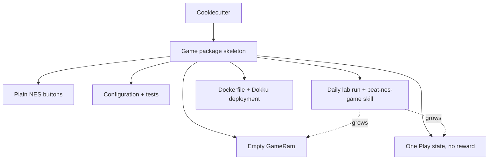
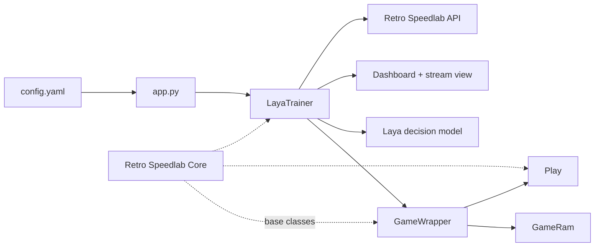

# Retro Speedlab Cookiecutter

[](https://github.com/datenwissenschaften/retro-speedlab/actions/workflows/ci.yml)  [](LICENSE)

A Cookiecutter template that scaffolds a game package for
[Retro Speedlab](https://www.retrospeedlab.com), the lab where the Laya decision
model learns to beat retro games by itself. The generated package starts as a
skeleton that knows nothing about its game. Scheduled Claude Code lab runs grow
it from what they verify in the emulator, and the
[Retro Speedlab Core](https://github.com/datenwissenschaften/retro-speedlab-core)
engine turns it into a learning agent.

## What it generates


```mermaid
flowchart TD
    CC[Cookiecutter] --> GEN[Game package skeleton]
    GEN --> A[Plain NES buttons]
    GEN --> B[Empty GameRam]
    GEN --> C[One Play state, no reward]
    GEN --> D[Configuration + tests]
    GEN --> E[Daily lab run + beat-nes-game skill]
    GEN --> F[Dockerfile + Dokku deployment]
    E -. grows .-> B
    E -. grows .-> C
```

The template deliberately ships no game knowledge. Everything a game needs
(RAM map, phases, detectors, hints, rewards, savestates for new levels) is
built by the lab runs, which follow the bundled
`.claude/skills/beat-nes-game/SKILL.md`.

## Quick start

```bash
pipx install cookiecutter
cookiecutter https://github.com/datenwissenschaften/retro-speedlab
cd retro-speedlab-game
poetry install
poetry run python app.py
```

Put the ROM Stable Retro expects for the chosen game into `roms/` first; it is
imported automatically when training starts.

### Template variables

| Variable | Purpose |
| --- | --- |
| `project_name` | Human-readable project name |
| `project_slug` | Distribution and directory name, derived from `project_name` |
| `game` | Stable Retro game id, for example `SnakeRattleNRoll-Nes-v0` |
| `author_name` | Package author |
| `author_email` | Package author email, also used as the lab run's git identity |

Pressing enter at every prompt accepts the defaults, equivalent to
`cookiecutter ... --no-input`.

## Generated project structure

```text
retro-speedlab-game/
├── .claude/
│   ├── settings.json
│   └── skills/beat-nes-game/
├── agent/
│   ├── daily.sh
│   ├── PROMPT.md
│   └── reports/
├── dokku/
│   ├── deploy.sh
│   ├── settings.sh
│   └── setup.sh
├── app.py
├── config.yaml
├── Dockerfile
├── pyproject.toml
├── roms/
├── savestates/
├── src/
│   ├── game/
│   │   ├── actions.py
│   │   └── wrapper.py
│   ├── ram/
│   │   └── game.py
│   └── states/
│       └── play.py
└── tests/
    └── test_play.py
```

`app.py` starts `LayaTrainer` with the game wrapper:


```mermaid
flowchart LR
    CFG[config.yaml] --> APP[app.py]
    APP --> TRAINER[LayaTrainer]
    TRAINER --> WRAP[GameWrapper]
    WRAP --> RAM[GameRam]
    WRAP --> STATE[Play]
    TRAINER --> LAYA[Laya decision model]
    TRAINER --> UI[Dashboard + stream view]
    TRAINER --> API[Retro Speedlab API]
    CORE[Retro Speedlab Core] -.base classes.-> WRAP
    CORE -.-> STATE
    CORE -.-> TRAINER
```

## The skeleton

- `src/game/actions.py` offers the plain NES buttons: held directions and
  tapped `A`/`B`, each a four-frame button sequence with a description Laya
  chooses between.
- `src/ram/game.py` declares an empty `GameRam`, so Laya is told nothing about
  the game yet.
- `src/states/play.py` is a single `Play` state that asks "Which move?", pays no
  reward and ends an attempt after 18,000 frames.
- `tests/test_play.py` pins down that the skeleton knows nothing yet.

A constant reward means Laya picks every action with equal probability, so the
first lab runs ship a learning signal from verified RAM (lives, score,
progress) before anything else.

## Lab runs

Training runs around the clock in a [Dokku](https://dokku.com) app on a GPU
server with at least 6 GB of memory. Four times a day (`agent.schedule`) Claude
Code runs unattended in a one-off container of the same app. Each lab run works
toward the next step of the level's walkthrough: it measures the progress,
verifies RAM and objects in the emulator, ships at least one tested change to
the game package, deploys it and writes a lab report. The permissions in
`.claude/settings.json` forbid `sudo`, pushing and editing the training data.

## Configuration

`config.yaml` is the single source for the game, its levels, paths, uploads,
logging, the local UI and the server deployment:

| Section | Purpose |
| --- | --- |
| `paths` | ROM, savestate, model, recording, cache, and lab report directories, and the JSON training database, relative to the project |
| `training` | Game ID, levels in training order, speedrun turn length, and fingerprint |
| `laya` | The Laya checkpoint (Hugging Face Hub ID or local directory) |
| `log_level` | Standard Python logging level |
| `upload` | Retro Speedlab API endpoint and key for beaten levels and lab reports (`null` for local-only training) |
| `ui` | Live stream relay to the backend: episodes kept, release, and persona |
| `twitch` | Short lab reports on the stream, written by free OpenRouter models |
| `dokku`, `agent` | GPU server deployment and the schedule of the lab runs |

All paths are relative to the project directory, so a generated project can be
moved without editing machine-specific values. Do not commit a real
`upload.api_key`.

## Reproducibility

- The generated project pins `datenwissenschaften` (Retro Speedlab Core) to its
  major version, and the engine pins every dependency it requires to an exact
  version.
- Generated projects target Python 3.12 (`py312`), the only version the engine
  supports.
- `.pre-commit-config.yaml` pins every hook to an immutable tag.
- CI (`.github/workflows/ci.yml`) generates a real project from this template on
  every push and pull request, installs it, runs its lint, format, and test
  checks, and smoke-tests `app.py` by importing it without an emulator ROM.

To test the template itself:

```bash
poetry install
poetry run ruff check --config pyproject.toml .
poetry run ruff format --config pyproject.toml --check .
poetry run pytest tests/
```

The `--config pyproject.toml` flag keeps Ruff from reading the generated
project's own `pyproject.toml`, which is not valid TOML until it is rendered.

## ROM and licensing notes

- This repository and template never bundle ROMs, copyrighted game assets,
  savestates you cannot legally redistribute, or credentials. `roms/` only
  ships a `.gitkeep` placeholder.
- `.gitignore` in the generated project excludes ROMs, `working/` training
  output, `*.bk2` recordings, and `.env` files. `config.yaml` is committed, so
  keep `upload.api_key` at `null` there.
- You are responsible for only using ROMs you have the legal right to use.

## Relationship to Retro Speedlab

- **`retro-speedlab`** (this repository) generates game package skeletons.
- **[`retro-speedlab-core`](https://github.com/datenwissenschaften/retro-speedlab-core)**
  (published as `datenwissenschaften`) is the engine: Laya decisions,
  reward-driven fine-tuning, per-state checkpoints, curriculum, recording,
  uploads, and telemetry.
- **[retrospeedlab.com](https://www.retrospeedlab.com)** is the lab's website:
  the live stream, the levels Laya has beaten, and the short lab reports.

A generated project depends on the engine and contains only game knowledge;
everything reusable across games is imported, not copied.

## License

GPL-3.0-only
