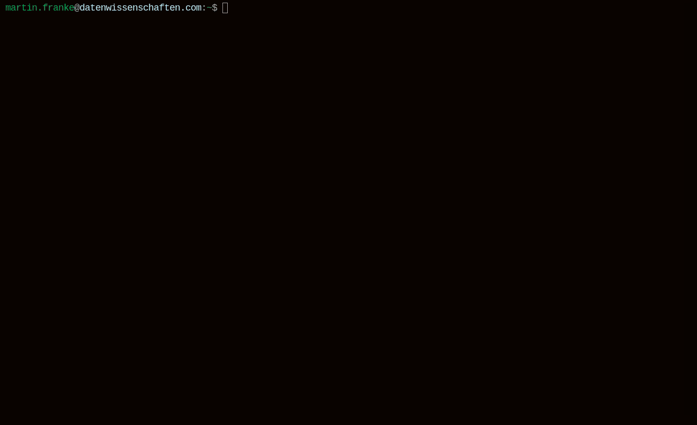
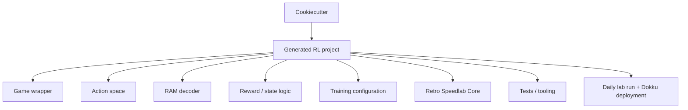
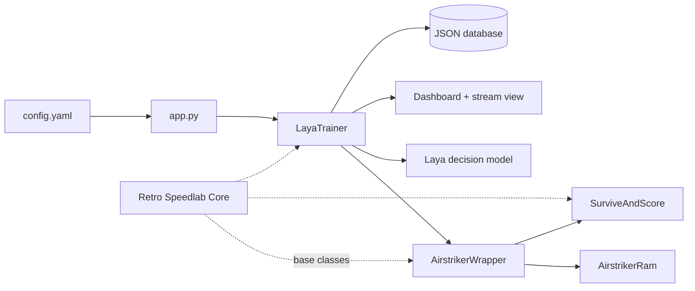

# Retro Speedlab Cookiecutter

[](https://github.com/datenwissenschaften/retro-speedlab/actions/workflows/ci.yml)   [](https://github.com/datenwissenschaften/retro-speedlab/commits/main) [](LICENSE) 

A Cookiecutter template that scaffolds a game package for
[Retro Speedlab](https://www.retrospeedlab.com): a Stable Retro project in which
the Laya decision model learns to beat a retro game by itself, built on the
[Retro Speedlab Core](https://github.com/datenwissenschaften/retro-speedlab-core)
training engine.



## What it generates


```mermaid
flowchart TD
    CC[Cookiecutter] --> GEN[Generated RL project]
    GEN --> A[Game wrapper]
    GEN --> B[Action space]
    GEN --> C[RAM decoder]
    GEN --> D[Reward / state logic]
    GEN --> E[Training configuration]
    GEN --> F[Retro Speedlab Core]
    GEN --> G[Tests / tooling]
    GEN --> H[Daily lab run + Dokku deployment]
```

The generated project ships:

- a runnable `Airstriker-Genesis-v0` example
- YAML-based paths and training configuration
- a state-machine Gymnasium wrapper
- typed RAM decoding and reward shaping
- a reduced discrete action space
- the Laya decision model, fine-tuned from rewards
- local training telemetry, controls, and a stream view for OBS
- a `tests/` suite covering actions, RAM decoding, and reward logic
- Poetry, Ruff, and pre-commit configuration
- a Dockerfile and Dokku scripts that train around the clock on a GPU server
- a scheduled Claude Code lab run that grows the game package and writes lab
  reports, guided by the bundled `beat-nes-game` skill

## Quick start

```bash
pipx install cookiecutter
cookiecutter https://github.com/datenwissenschaften/retro-speedlab
cd your-project-name
poetry install
poetry run python app.py
```

The generated Airstriker example uses the freeware game and `Level1`
savestate bundled with Stable Retro. A commercial ROM is not required for
the first run.

### Template variables

| Variable | Purpose |
| --- | --- |
| `project_name` | Human-readable project name |
| `project_slug` | Distribution and directory name, derived from `project_name` |
| `version` | Initial project version |
| `description` | Project summary |
| `author_name` | Package author |
| `author_email` | Package author email |
| `license` | SPDX license expression |
| `python_requires` | Supported Python range (keep at `>=3.12,<3.13`; see [Reproducibility](#reproducibility)) |
| `python_classifier` | Python classifier version (keep at `3.12`) |
| `python_target` | Ruff target version (keep at `py312`) |
| `development_status` | PyPI development status classifier |

### Example output

```text
$ cookiecutter https://github.com/datenwissenschaften/retro-speedlab
  [1/11] project_name (Retro Speedlab):
  [2/11] project_slug (retro-speedlab):
  [3/11] version (0.0.1):
  [4/11] description (Teach the Laya decision model to beat a retro game by itself.):
  [5/11] author_name (author_name):
  [6/11] author_email (author_email@example.com):
  [7/11] license (GPL-3.0-only):
  [8/11] python_requires (>=3.12,<3.13):
  [9/11] python_classifier (3.12):
  [10/11] python_target (py312):
  [11/11] development_status (1 - Planning):
```

Pressing enter at every prompt accepts the defaults shown in parentheses,
equivalent to `cookiecutter ... --no-input`.

## Generated project structure

```text
your-project/
├── .claude/
│   ├── settings.json
│   └── skills/beat-nes-game/
├── agent/
│   ├── daily.sh
│   ├── PROMPT.md
│   └── reports/
├── dokku/
│   ├── deploy.sh
│   ├── settings.sh
│   └── setup.sh
├── app.py
├── config.yaml
├── Dockerfile
├── pyproject.toml
├── roms/
│   └── .gitkeep
├── savestates/
│   └── .gitkeep
├── src/
│   ├── game/
│   │   ├── actions.py
│   │   └── wrapper.py
│   ├── ram/
│   │   └── airstriker.py
│   └── states/
│       └── survive.py
└── tests/
    ├── test_actions.py
    ├── test_ram_airstriker.py
    └── test_survive_state.py
```

`app.py` starts `LayaTrainer` with the game wrapper:


```mermaid
flowchart LR
    CFG[config.yaml] --> APP[app.py]
    APP --> TRAINER[LayaTrainer]
    TRAINER --> WRAP[AirstrikerWrapper]
    WRAP --> RAM[AirstrikerRam]
    WRAP --> STATE[SurviveAndScore]
    TRAINER --> LAYA[Laya decision model]
    TRAINER --> UI[Dashboard + stream view]
    TRAINER --> DB[(JSON database)]
    LIB[Retro Speedlab Core] -.base classes.-> WRAP
    LIB -.-> STATE
    LIB -.-> TRAINER
```

## Example: Airstriker

`Airstriker-Genesis-v0` is the freeware Sega Genesis game bundled with
Stable Retro for testing, so the example trains without a commercial ROM.

- `src/game/actions.py` defines three described actions as four-frame
  button sequences; Airstriker only fires when the button is re-pressed, so
  every action taps fire once.
- `src/game/wrapper.py` registers the states, RAM layout, and actions.
- `src/ram/airstriker.py` decodes word-swapped Genesis RAM into score,
  lives, game-over state, and ship position, and describes them to Laya.
- `src/states/survive.py` rewards score gains and survival, penalizes lost
  lives and game-over, and bounds episode length.
- Laya picks every action; each state's `description` is the question it
  answers, and group-relative policy gradients fine-tune it from rewards.

## Adapting to another game

1. Change `training.game` and `training.savestates` (the levels in training
   order) in `config.yaml`.
2. Replace the controller mapping and action descriptions in
   `src/game/actions.py`.
3. Define verified RAM offsets in `src/ram/`.
4. Implement game-specific rewards, termination, and a question for Laya
   (`description`) in `src/states/`.
5. Register those types in `src/game/wrapper.py`.
6. Update `tests/` to match the new action table and RAM layout.

Place legally obtained ROMs in `roms/`. Stable Retro imports them
automatically when training starts. Do not commit commercial ROMs or API
credentials.

## Configuration

`config.yaml` is the single source for game selection, levels, paths, uploads,
logging, the local UI, and the server deployment:

| Section | Purpose |
| --- | --- |
| `paths` | ROM, savestate, model, recording, cache, and lab report directories, and the JSON training database, relative to the project |
| `training` | Game ID, levels in training order, speedrun turn length, and fingerprint |
| `laya` | The Laya checkpoint (Hugging Face Hub ID or local directory) |
| `log_level` | Standard Python logging level |
| `upload` | Retro Speedlab API endpoint and key for beaten levels and lab reports (`null` for local-only training) |
| `ui` | Local telemetry dashboard and stream view host, port, and persona |
| `twitch` | Short lab reports on the stream, written by free OpenRouter models |
| `dokku`, `agent` | GPU server deployment and the schedule of the daily lab run |

All paths are relative to the project directory, so a generated project can
be moved without editing machine-specific values. Do not commit a real
`upload.api_key`; keep it `null` unless you intend to upload beaten levels and
lab reports.

## Reproducibility

- The generated project pins `datenwissenschaften` (the Retro Speedlab
  library) to a tested version range, and every other dependency the
  library requires is itself pinned to an exact version.
- `python_requires`, `python_classifier`, and `python_target` currently
  must stay at Python 3.12 (`py312`), because the pinned library only
  supports that version. Overriding them independently will produce a
  project whose declared Python support does not match its dependency.
- `.pre-commit-config.yaml` pins every hook to an immutable tag (no moving
  branches such as `stable` or `main`).
- CI (`.github/workflows/ci.yml`) generates a real project from this
  template on every push and pull request, installs its dependencies, runs
  its lint, format, and test checks, and smoke-tests `app.py` by importing
  it (without running training or requiring an emulator ROM).

To test the template itself (not a generated project):

```bash
poetry install
poetry run ruff check --config pyproject.toml .
poetry run ruff format --config pyproject.toml --check .
poetry run pytest tests/
```

The `--config pyproject.toml` flag is required here because linting the
un-rendered template source directly (from this repository's root) would
otherwise pick up the generated project's own `pyproject.toml` while
walking a `{{ cookiecutter.project_slug }}/...` path, which is not valid
TOML until it's rendered.

## Testing the generated project

```bash
poetry run ruff check .
poetry run ruff format --check .
poetry run pytest
```

`tests/` covers the action table, RAM decoding, and reward/termination
logic without an emulator. It does not exercise `app.py` itself, which
needs Stable Retro's emulator core and a GPU for Laya; CI instead
smoke-tests `app.py` by importing it (see [Reproducibility](#reproducibility)).

## ROM and licensing notes

- `Airstriker-Genesis-v0` uses **Airstriker** by Electrokinesis, a freeware
  game bundled with Stable Retro specifically for testing. No commercial
  ROM is required or included.
- This repository and template never bundle commercial ROMs, copyrighted
  game assets, savestates you cannot legally redistribute, or credentials.
  `roms/` only ships a `.gitkeep` placeholder.
- `.gitignore` (both here and in the generated project) excludes `working/`
  training output, `*.bk2` replay recordings, and standard secret/credential
  file patterns.
- If you adapt the example to another game, you are responsible for only
  using ROMs you have the legal right to use, and for not committing them.

## Relationship to Retro Speedlab

**`retro-speedlab`** (this repository) is a project generator: it scaffolds
a runnable game wrapper, action space, RAM decoder, reward logic, training
configuration, tests, and tooling for a specific game.

**[`retro-speedlab-core`](https://github.com/datenwissenschaften/retro-speedlab-core)**
(published as the `datenwissenschaften` package) is the reusable training
engine: the Laya decision model, its reward-driven fine-tuning, the
state-machine environment, resumable checkpoints, uploads, and live telemetry.

**[retrospeedlab.com](https://www.retrospeedlab.com)** is the lab's website:
the live stream, the levels Laya has beaten, and the short lab reports
uploaded by generated projects.

A generated project depends on the library; it does not reimplement it.
Game-specific code (actions, RAM offsets, reward shaping) lives in the
generated project. Everything reusable across games — the model, trainer,
environment builder, state machine base classes — lives in the library and
is imported, not copied.

## License

GPL-3.0-only
